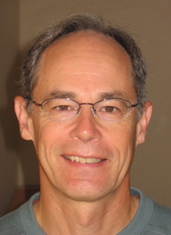
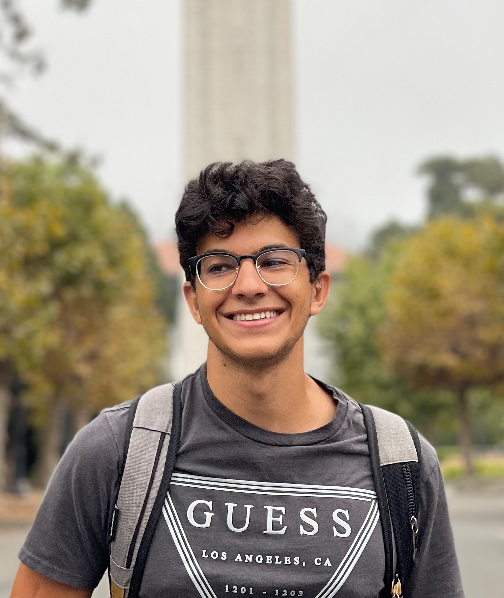
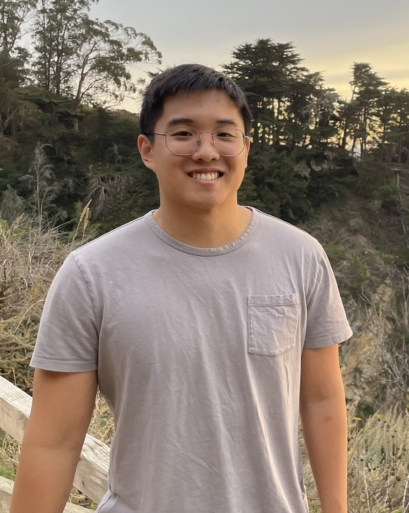
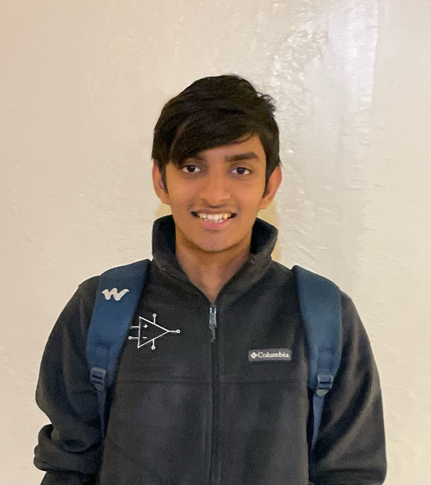
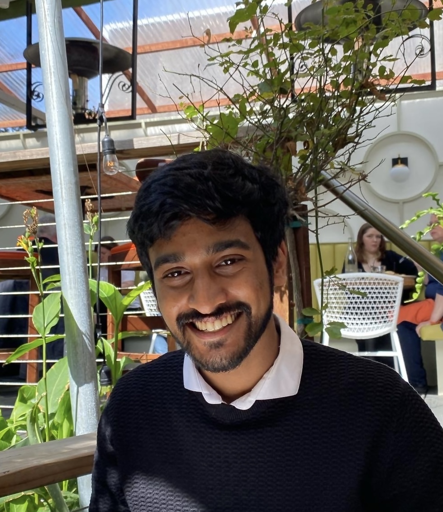

## Course Outline

- Ask questions on our [Ed forum](https://edstem.org/us/join/P9DZPV) for this semester.
- Homeworks will be posted as links in the [outline](#course-outline) below.
- Please submit completed homework via [Gradescope](https://www.gradescope.com/courses/714080).

### [Lecture Playlist](https://www.youtube.com/playlist?list=PLnocShPlK-Fs5kiCliipArBuda3Mv-ZwM)
### [Lab/OH Queue Form](https://forms.gle/NHcuqonSwAQALuea7)

 | Week | Date | Lecture Topic | Discussion | ASIC Lab | FPGA Lab | Homework |
 | ---  | ---  | ---           | ---        | ---      | ---      | ---      |
 | 1  | 1/17 | Class Organization & Introduction to Course Content ([slides](./files/lec1-intro.pdf)) ([recording]( https://drive.google.com/file/d/1sKchXxILDCqcwwVqbPjQgiYwcleyVbGm/view?usp=sharing)) | [Discussion 1 (slides)](./files/discussion1_slides.pdf) ([worksheet](./files/discussion1.pdf)) | No Lab | No Lab | [Homework 1](./files/hw_sp24/hw1.pdf) |
 | 2  | 1/22 | Design Alternatives & ASIC Flow([slides](./files/lec2-design.pdf)) ([recording]( https://www.youtube.com/watch?v=kYDoNwnFNHY&list=PLnocShPlK-Fs5kiCliipArBuda3Mv-ZwM&index=1)) | [Discussion 2 (slides)](./files/discussion_sp24/Discussion2.pdf) ([worksheet](./files/discussion_sp24/disc2.pdf)) ([solutions](./files/discussion_sp24/disc2_solutions.pdf)) | [Lab 1](https://github.com/EECS150/asic-labs-sp24/tree/main)  | [Lab 1](https://github.com/EECS150/fpga_labs_sp24/tree/main/lab1) | [Homework 2](./files/sp24_hw2.pdf) |
 |   | 1/24 | Verilog Part 1 ([slides](./files/lec3-verilog1.pdf)) ([recording](https://www.youtube.com/watch?v=BPZKyzTc_Jg&list=PLnocShPlK-Fs5kiCliipArBuda3Mv-ZwM&index=2)) | | | | |
 | 3  | 1/29 | Verilog Part 2 ([slides](./files/lec4-verilog2.pdf)) ([recording](https://www.youtube.com/watch?v=MmU6JCUryVU&list=PLnocShPlK-Fs5kiCliipArBuda3Mv-ZwM&index=3)) | [Discussion 3 (slides)](./files/discussion_sp24/discussion3.pdf) ([worksheet](./files/discussion_sp24/sp24_disc3.pdf)) ([solutions](./files/discussion_sp24/sp24_disc3_solutions.pdf))  | [Lab 2](https://github.com/EECS150/asic-labs-sp24/tree/main/lab2) | [Lab 2](https://github.com/EECS150/fpga_labs_sp24/tree/main/lab2) | [Homework 3](./files/hw_sp24/hw3_final.pdf) |
 |   | 1/31 | FPGA Architecture ([slides](./files/lec5-FPGA.pdf)) ([recording](https://www.youtube.com/watch?v=1tg1A2J1OFA&list=PLnocShPlK-Fs5kiCliipArBuda3Mv-ZwM&index=4)) | | | | |
 | 4  | 2/5  | Combinational Logic & Boolean Algebra ([slides](./files/lec6-CL.pdf)) | | Lab 3 | Lab 3 | Homework 4 |
 |    | 2/7  | Finite State Machines 1 ([slides](./files/lec7-CL2-FSM1.pdf)) | | |  | |
 | 5  | 2/12 | Finite State Machines 2 ([slides](./files/lec8-FSM2.pdf)) | | Lab 4 | | Homework 5 |
 |    | 2/14 | CMOS Circuits 1 ([slides](./files/lec9-CMOS1.pdf)) | | |  | |
 | 6  | 2/19 | CMOS Circuits 2 ([slides](./files/lec10-CMOS2.pdf)) | | Lab 4 | | Homework 6 |
 |    | 2/21 | Circuit Timing Part 1 ([slides](./files/lec11-timing1.pdf)) | | | | |
 | 7  | 2/26 | Circuit Timing Part 2 ([slides](./files/lec12-timing2.pdf)) | | | Lab 5 | Homework 7 |
 |    | 2/28 | RISC-V Microarchitecture and Implementation ([slides](./files/lec13-riscv1.pdf)) | | | | |
 | 8  | 3/4  | Midterm Review ([slides](./files/lec14-review.pdf)) | | Lab 5 | | |
 |   | 3/6  | No Class - Midterm 6-9PM | | | | |
 | 9  | 3/11 | RISC-V Part 2 ([slides](./files/lec15-riscv2.pdf))| | ASIC Project | FPGA Project | Homework 8 |
 |   | 3/13 | RISC-V Part 3 | | | | |
 | 10 | 3/18 | Power and Energy ([slides](./files/lec22-energy.pdf))| | | | Homework 9 |
 |    | 3/20 | Memory Blocks 1 ([slides](./files/lec17-mem1.pdf)) | | | | |
 | 11 | 3/25 | Spring Recess | |  | | |
 |    | 3/27 | Spring Recess | | | | |
 | 12 | 4/1 | Memory Blocks 2 ([slides](./files/lec19-mem2.pdf))| | | | Homework 10 |
 |   | 4/3  | Parallelism ([slides](./files/lec20-par.pdf))| | | | |
 | 13 | 4/8  | List Processor Example Design ([slides](./files/lec21-listproc.pdf)) | | | | Homework 11 |
 |    | 4/10 | Guest Speaker TBA | | | | |
 | 14 | 4/15 | Adders ([slides](./files/lec23-adders.pdf)) | | | | Homework 12 |
 |    | 4/17 | Multipliers & Shifters ([slides](./files/lec24-mult-shift.pdf))  | | | | |
 | 15 | 4/22 | Clock and Power Distribution ([slides](./files/lec25-clk-pkg-pwr.pdf)) | | | | Homework 13 |
 |    | 4/24 | Wrap-up and Exam Review ([slides](./files/lec26-wrapup.pdf)) | | | | |
 | 16 | 4/29  | RRR No Lecture | | | | |
 |    | 5/1  | RRR No Lecture | | Final Checkoff (Report due midnight 5/6) | | |
 | FINAL | 5/7 |    No Class - Final Exam 11:30A - 2:30P

<iframe src="https://calendar.google.com/calendar/embed?height=600&wkst=1&bgcolor=%23ffffff&ctz=America%2FLos_Angeles&title=EECS%20151%20Calendar&mode=WEEK&src=Y182YTRkN2M4MjNlZWYxMGNlMThhNWMxODZiNjg1MjRhYzYwNGI1ZDFmZmZhMTQ5NmRlNDUwOWUxYTNmNTg2YjBmQGdyb3VwLmNhbGVuZGFyLmdvb2dsZS5jb20&src=Y18wNzVhMzZkOWYzNDI3OTE2OTI1N2Q5ZjNkNjcyNjliMTNmNWNkMjVkMjg4MzE4MTZkZTdlZWNjOWU4OTg2ZTkyQGdyb3VwLmNhbGVuZGFyLmdvb2dsZS5jb20&src=Y18xMDE5Y2FhNzY4NjgzMjJiOTMzYTc1YjRkNjI2ZmIyOTQwNjZmMThhNmEyMmEyNGY0YzYzZDU5MWQwNWU2MjNlQGdyb3VwLmNhbGVuZGFyLmdvb2dsZS5jb20&src=Y19kNjZlODNiNjc2NzI5MjM5NjcxM2E4ZmVkM2RkZmNiNDQ1MDk2MzdiYzEzZmFmMDMyYTJkYzQ0ZDlkNTk4MzIxQGdyb3VwLmNhbGVuZGFyLmdvb2dsZS5jb20&src=Y183OWZlYzMwMTI0OWZmNThjZGZlMTQ5MjJlMWQ0NWM5YzI2NGE3YzI3Y2M5ODk3YWQ3OGNiNWE0MjZiYzFjYjQ1QGdyb3VwLmNhbGVuZGFyLmdvb2dsZS5jb20&color=%237CB342&color=%23B39DDB&color=%23E67C73&color=%23F6BF26&color=%23039BE5" style="border:solid 1px #777; width:80%" height="600"></iframe>

## Lectures, Labs, Office Hours

 | Content       | Days      | Times               | Location     | Staff           |
 | ---           | ---       | ---                 | ---          | ---             |
 | Lectures      | Mon, Wed  | 2:00 pm - 3:30 pm   | Soda 306     | John Wawrzynek  |
 | Discussion    | Fri       | 10:00 am - 11:00 am | Cory 540AB   | Justin Kalloor  |
 |               | Fri       | 3:00 pm - 4:00 pm   | Wheeler 108  | Kevin Anderson  |
 |               | Fri       | 4:00 pm - 5:00 pm   | Hearst Mining 310 | Kevin Anderson |
 | ASIC Lab      | Tu        | 11:00 am - 2:00 pm  | Cory 111/117 | Kevin He        |
 |               | Tu        | 2:00 pm - 5:00 pm   | Cory 111/117 | Kevin Anderson  |
 | FPGA Labs     | Mon       | 8:00 am - 11:00 am  | Cory 111/117 | Daniel Endraws |
 |               | Mon       | 11:00 am - 2:00 pm  | Cory 111/117 | Daniel Endraws |
 |               | Tu        | 8:00 am - 11:00 am  | Cory 111/117 | Rohit Kanagal |
 |               | Mon       | 5:00 pm - 8:00 pm   | Cory 111/117 | Dhruv Vaish |
 | Office Hours  | Mon       | 3:30 pm - 4:30 pm   | 631 Soda     | John Wawrzynek  |
 |               | Tu        | 5:00 pm - 7:00 pm   | Cory 111/117 | Kevin He  |
 |               | Tu        | 5:30 pm - 6:30 pm   | Cory 111/117 | Allen Chen |
 |               | Wed       | 4:30 pm - 6:30 pm   | Cory 111/117 | Dhruv's OH |
 |               | Thurs     | 9:00 am - 11:00 am  | Cory 111/117 | Daniel Endraws |
 |               | Thurs     | 4:00 pm - 6:00 pm   | Cory 111/117 | Kevin Anderson |
 |               | Fri       | 9:00 am - 10 am     | Cory 111/117 | Rohit Kanagal  |
 |               | Fri       | 11:00 am - 12:00 pm | Cory 111/117 | Justin Kalloor |
 |               | Fri       | 12:00 pm - 2:00 pm  | Cory 111/117 | Reuben Thomas |

## Discussions, Homework ##

- Conceptual and homework questions should be directed to [Ed forum](https://edstem.org/us/join/P9DZPV) for this semester.
- Homeworks will be posted as links in the [outline](#course-outline), available in PDF format.
- Please submit completed homework via [Gradescope](https://www.gradescope.com/courses/714080). Homework will be released on Fridays before midnight, and will be due on the Monday 10 days later.

## Staff ##

| {:width="120"}   | John Wawrzynek  | johnw at berkeley dot edu           |
| {:width="120"} | Kevin Anderson   (Discussion, HW, ASIC Lab) | kevinand at berkeley dot edu  |
| {:width="120"} | Justin Kalloor   (Discussion & HW) | jkalloor3 at berkeley dot edu  |
| {:width="120"}  | Dhruv Vaish   (FPGA Lab)    | dvaish at berkeley dot edu          |
| {:width="120"} | Daniel Endraws   (FPGA Lab)  | daniel.endraws at berkeley dot edu  |
| {:width="120"} | Kevin He   (ASIC Lab) | kevinjhe at berkeley dot edu  |
| {:width="120"} | Rohit Kanagal   (FPGA Lab) | rkanagal at berkeley dot edu  |
| {:width="120"} | Reuben Thomas   (Reader) | reubenkthomas at berkeley dot edu |

## Resources ##
- [RISC-V Green Card](./files/verilog/riscvcard.pdf)
- [61C Reference](./files/verilog/reference-card.pdf)
- [IEEE 1364-2005 Verilog-Standard](./files/verilog/verilog-std-1364-2005.pdf)
- [EECS151 Register Library](./files/lib/EECS151.v)
- [Online Verilog Simulator (edaplayground)](https://www.edaplayground.com/)
- [LTspice Tutorial](./files/spice_tutorial.pdf)

## Previous Exams ##
- Spring 2023 midterm ([blank](./files/exam1.pdf)) ([solution](./files/exam1_solution.pdf))
- Spring 2021 midterm ([blank](./files/sp21_exam1.pdf))([solutions](./files/sp21_exam1_solution.pdf))
- Spring 2020 midterm ([blank](./files/sp20_exam1.pdf))([solutions](./files/sp20_exam1_sol.pdf))

- Spring 2021 final ([blank](./files/sp21_final.pdf)) ([partial solutions](./files/sp21_final_sol.pdf))
- Spring 2020 final ([blank](./files/sp20_final.pdf)) ([solutions](./files/sp20_final_sol.pdf))
- Spring 2019 final ([blank](./files/sp19_final.pdf))

## Homework Policy ##

Homework will be released on Fridays before midnight, and will be due on the Monday 10 days later. Homework will be challenging and graded for correctness.

## Grading ##

### Class ###

| Problem Sets    | 30% |
| Participation   | 5%  |
| Midterm         | 30% |
| Final           | 35% |

### ASIC Labs ###

| Lab Reports | 25% |
| Project     | 75% |

### FPGA Labs ###

| Lab Checkoffs + Reports | 25% |
| Project                 | 75% |

## Cheating Policy ##

* If you turn in someone else's work as if it were your own, you are guilty of cheating.  This includes problem sets, answers on exams, lab exercise checks, project design, and any required course turn-in material.
* Also, if you knowingly aid in cheating, you are guilty.
* We have software that compares your submitted work to others.
* However, it is okay to discuss with others lab exercises and the project (obviously, okay to work with project partner).  Okay to discuss homework with others.  But everyone must turn in their own work.
* Do not post your work on public repositories like github (private o.k.)
* **If we catch you cheating, you will get negative points on the assignment: It is better to not do the work than to cheat! If it is a midterm exam, final exam, or final project, you get an F in the class.  All cases of cheating reported to the office of student conduct. **
<!--
// vim: set nowrap :
-->
